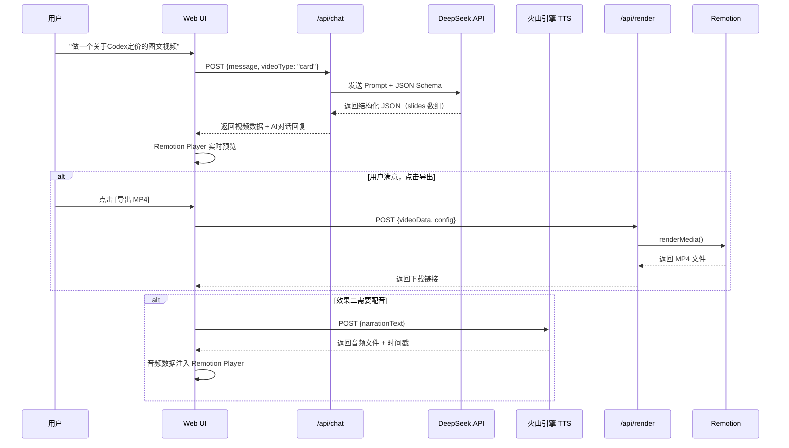

# 自媒体 AI 文生视频智能体 — 完整实施计划

## 已确认的技术决策

| 决策项 | 选型 |
|:---|:---|
| AI 文案引擎 | DeepSeek API |
| AI 配音 | 火山引擎 TTS |
| 视频渲染 | Remotion (React/TypeScript) |
| 交互形式 | Web UI + 对话式输入 |
| 全栈框架 | Next.js (TS 全栈) |
| AI 视频模型 | 暂不使用 |

---

## 项目结构

```
ai-video-agent/
├── package.json
├── tsconfig.json
├── next.config.ts
├── remotion.config.ts                 # Remotion 配置
├── .env.local                         # API Keys
│
├── src/
│   ├── app/                           # Next.js App Router
│   │   ├── layout.tsx                 # 全局布局
│   │   ├── page.tsx                   # 首页 — 对话 + 预览
│   │   └── api/
│   │       ├── chat/
│   │       │   └── route.ts           # 对话接口 → DeepSeek
│   │       ├── tts/
│   │       │   └── route.ts           # TTS 接口 → 火山引擎
│   │       └── render/
│   │           └── route.ts           # 视频渲染接口 → Remotion
│   │
│   ├── components/
│   │   ├── ChatPanel.tsx              # 对话输入面板
│   │   ├── VideoPreview.tsx           # Remotion Player 预览
│   │   ├── ControlPanel.tsx           # 模板/音色/导出控制
│   │   └── MessageBubble.tsx          # 聊天消息气泡
│   │
│   ├── remotion/                      # Remotion 视频组件
│   │   ├── index.ts                   # 注册所有 Composition
│   │   │
│   │   ├── compositions/
│   │   │   ├── CardVideo.tsx          # 效果一：图文卡片视频主入口
│   │   │   └── AlgoVideo.tsx          # 效果二：算法可视化视频主入口
│   │   │
│   │   ├── templates/                 # 效果一的 6 种模板页
│   │   │   ├── TitleSlide.tsx         # ① 标题封面页
│   │   │   ├── NumberedListSlide.tsx  # ② 编号要点页
│   │   │   ├── ComparisonSlide.tsx    # ③ 左右对比页
│   │   │   ├── StepsSlide.tsx         # ④ 步骤指引页
│   │   │   ├── QuoteSlide.tsx         # ⑤ 引用+总结页
│   │   │   └── EndingSlide.tsx        # ⑥ 结尾互动页
│   │   │
│   │   ├── algo/                      # 效果二的算法可视化组件
│   │   │   ├── GridBoard.tsx          # 网格/矩阵面板
│   │   │   ├── StepIndicator.tsx      # 步骤进度指示器
│   │   │   ├── CodeHighlight.tsx      # 代码高亮展示
│   │   │   └── NarrationSubtitle.tsx  # 旁白字幕层
│   │   │
│   │   ├── shared/                    # 共享动画/样式组件
│   │   │   ├── AnimatedText.tsx       # 文字动画（淡入/打字机）
│   │   │   ├── SlideTransition.tsx    # 页面转场
│   │   │   ├── GradientTitle.tsx      # 渐变色标题
│   │   │   ├── NumberBadge.tsx        # 编号圆形标记
│   │   │   └── Background.tsx         # 深色背景 + 光效
│   │   │
│   │   └── styles/
│   │       ├── theme.ts              # 配色/字体/间距 token
│   │       └── fonts.ts              # 字体加载（中文支持）
│   │
│   ├── lib/                           # 核心业务逻辑
│   │   ├── deepseek.ts               # DeepSeek API 封装
│   │   ├── volcengine-tts.ts          # 火山引擎 TTS 封装
│   │   ├── renderer.ts               # Remotion 服务端渲染逻辑
│   │   ├── prompts/
│   │   │   ├── card-video.ts          # 效果一的 Prompt 模板
│   │   │   └── algo-video.ts          # 效果二的 Prompt 模板
│   │   └── types/
│   │       ├── card-video.ts          # 效果一的数据类型定义
│   │       └── algo-video.ts          # 效果二的数据类型定义
│   │
│   └── hooks/
│       ├── useChat.ts                 # 对话状态管理
│       └── useVideoData.ts           # 视频数据状态管理
│
└── public/
    ├── fonts/                         # 中文字体文件
    │   └── NotoSansSC-*.woff2
    └── audio/                         # 背景音乐素材
        └── bgm-tech-01.mp3
```

---

## 核心数据流



---

## 数据类型定义

### 效果一：图文卡片视频

```typescript
// src/lib/types/card-video.ts

interface CardVideoData {
  meta: {
    title: string;
    category: string;          // "AI资讯" | "技术解读" | ...
    style: "dark-tech" | "minimal-light" | "gradient-purple";
    aspectRatio: "9:16";       // 竖屏
    bgmTrack?: string;         // 背景音乐路径
  };
  slides: Slide[];
}

type Slide =
  | TitleSlide
  | NumberedListSlide
  | ComparisonSlide
  | StepsSlide
  | QuoteSlide
  | EndingSlide;

interface TitleSlide {
  type: "title";
  category: string;            // 分类标签 "AI资讯"
  heading: string;             // 主标题 "Codex定价大地震"
  subtitle: string;            // 副标题
  highlightWords?: string[];   // 渐变高亮的关键词
}

interface NumberedListSlide {
  type: "numbered_list";
  heading?: string;
  items: {
    text: string;
    detail?: string;
  }[];
  tags?: string[];             // 底部标签 ["PLUS用户必看", ...]
}

interface ComparisonSlide {
  type: "comparison";
  heading: string;             // "老方案 vs 新方案"
  left: {
    title: string;
    subtitle?: string;
    items: { text: string; positive?: boolean }[];
  };
  right: {
    title: string;
    subtitle?: string;
    items: { text: string; positive?: boolean }[];
  };
}

interface StepsSlide {
  type: "steps";
  heading: string;             // "PLUS/Pro用户怎么办？"
  subheading?: string;
  steps: {
    action: string;
    note?: string;             // 右侧说明
  }[];
  linkCard?: {
    title: string;
    url: string;
  };
}

interface QuoteSlide {
  type: "quote";
  heading?: string;
  quote: string;               // 引用原文
  source?: string;
  summary?: string;            // 总结金句
  discussionPrompts?: string[];// 互动问题
}

interface EndingSlide {
  type: "ending";
  authorName: string;
  authorAvatar?: string;
  callToAction: string;        // "关注获取更多AI资讯"
  tags?: string[];
}
```

### 效果二：算法可视化视频

```typescript
// src/lib/types/algo-video.ts

interface AlgoVideoData {
  meta: {
    title: string;             // "为什么腐烂橘子需要4分钟？"
    algorithm: string;         // "BFS" | "DFS" | "DP" | ...
    aspectRatio: "16:9";
    difficulty?: string;
  };
  narration: NarrationSegment[];  // 旁白分段
  steps: AlgoStep[];              // 动画步骤
}

interface NarrationSegment {
  text: string;                // 旁白文本
  durationMs?: number;         // 预估时长（TTS返回后覆盖）
  audioUrl?: string;           // TTS 生成后填入
  timestamps?: WordTimestamp[]; // 字幕时间戳
}

interface WordTimestamp {
  word: string;
  startMs: number;
  endMs: number;
}

interface AlgoStep {
  stepIndex: number;
  description: string;         // "从(1,0)开始BFS扩展"
  grid: CellState[][];         // 网格状态快照
  highlights?: [number, number][];  // 高亮的格子坐标
  annotation?: string;         // 右侧标注 "第2分钟"
  narrationIndex: number;      // 对应旁白分段索引
}

type CellState = {
  value: number;
  state: "fresh" | "rotten" | "empty" | "just_rotten";
};
```

---

## DeepSeek Prompt 设计

### 效果一的 System Prompt

```typescript
// src/lib/prompts/card-video.ts

export const CARD_VIDEO_SYSTEM_PROMPT = `你是一个自媒体短视频内容生成助手。
用户会给你一个主题，你需要生成一组图文卡片视频的内容。

## 输出要求
- 必须严格输出 JSON，符合以下 schema
- 生成 3-6 页 slides
- 第一页必须是 title 类型
- 最后一页必须是 ending 类型
- 中间页面根据内容自动选择最合适的类型
- 标题要有冲击力，善用 emoji
- 每页内容精炼，控制在 3-5 个要点以内
- 高亮关键词用 highlightWords 标注

## 可用的 slide 类型
- title: 标题封面页
- numbered_list: 编号要点页
- comparison: 左右对比页
- steps: 步骤指引页
- quote: 引用总结页
- ending: 结尾互动页

## JSON Schema
${JSON.stringify(cardVideoSchema)}`;
```

---

## 分阶段实施计划

### Phase 1：项目搭建 + 核心模板（第 1 周）

#### 1.1 项目初始化
- [ ] 用 `create-next-app` 初始化 Next.js 项目
- [ ] 安装 Remotion 相关依赖 (`remotion`, `@remotion/player`, `@remotion/cli`, `@remotion/renderer`)
- [ ] 配置 `remotion.config.ts`
- [ ] 安装中文字体（Noto Sans SC）
- [ ] 配置 `.env.local`（DeepSeek API Key）

#### 1.2 设计系统
- [ ] 实现 `theme.ts`（配色、字体、间距 token）
- [ ] 实现 `Background.tsx`（深色渐变背景 + 微光效果）
- [ ] 实现 `AnimatedText.tsx`（淡入/打字机/弹入动画）
- [ ] 实现 `GradientTitle.tsx`（渐变色大标题）
- [ ] 实现 `NumberBadge.tsx`（圆形编号标记）
- [ ] 实现 `SlideTransition.tsx`（页间滑动转场）

#### 1.3 6 种模板组件
- [ ] `TitleSlide.tsx` — 标题 + 副标题 + 分类标签 + 高亮词渐变
- [ ] `NumberedListSlide.tsx` — 编号要点 + 底部标签组
- [ ] `ComparisonSlide.tsx` — 左右两栏 + 正负标记
- [ ] `StepsSlide.tsx` — 步骤卡片 + 链接卡片
- [ ] `QuoteSlide.tsx` — 引用框 + 互动问题
- [ ] `EndingSlide.tsx` — 作者信息 + 引导关注

#### 1.4 视频 Composition
- [ ] `CardVideo.tsx` — 接收 `CardVideoData`，动态渲染 slides 序列 + 转场
- [ ] 用 `remotion studio` 验证所有模板在预览中的效果

---

### Phase 2：DeepSeek 接入 + Web UI（第 2 周）

#### 2.1 DeepSeek API 集成
- [ ] `deepseek.ts` — API 封装（流式输出）
- [ ] `card-video.ts` prompt — 编写 + 调试 System Prompt
- [ ] `/api/chat/route.ts` — 对话接口，返回 JSON + 对话回复

#### 2.2 Web UI
- [ ] `ChatPanel.tsx` — 对话输入框 + 消息列表
- [ ] `MessageBubble.tsx` — 用户/AI消息气泡
- [ ] `VideoPreview.tsx` — 嵌入 `@remotion/player` 实时预览
- [ ] `ControlPanel.tsx` — 模板风格选择 + 导出按钮
- [ ] `page.tsx` — 左右分栏布局（对话 | 预览）

#### 2.3 预览联调
- [ ] 对话输入 → DeepSeek 生成 JSON → Player 实时预览
- [ ] 实现"重新生成"和"修改某页"的对话能力

---

### Phase 3：视频导出 + 配音（第 3 周）

#### 3.1 视频渲染
- [ ] `renderer.ts` — 封装 `@remotion/renderer` 的 `renderMedia()`
- [ ] `/api/render/route.ts` — 接收 videoData，返回 MP4 文件/下载链接
- [ ] 渲染进度 WebSocket 推送

#### 3.2 背景音乐
- [ ] 准备 2-3 首免版权的 BGM 素材
- [ ] 在 CardVideo 中支持背景音乐轨道
- [ ] 音乐淡入淡出

#### 3.3 火山引擎 TTS 集成（为 Phase 4 做准备）
- [ ] `volcengine-tts.ts` — WebSocket 流式 TTS 封装
- [ ] `/api/tts/route.ts` — 文本 → 音频 + 时间戳
- [ ] 音色选择支持

---

### Phase 4：效果二 — 算法可视化视频（第 4-5 周）

#### 4.1 算法可视化组件
- [ ] `GridBoard.tsx` — 可动画化的网格矩阵
- [ ] `StepIndicator.tsx` — 步骤进度条
- [ ] `CodeHighlight.tsx` — 代码逐行高亮
- [ ] `NarrationSubtitle.tsx` — 旁白字幕（基于 TTS 时间戳同步）

#### 4.2 LLM 生成算法内容
- [ ] `algo-video.ts` prompt — 生成算法步骤 + 旁白文本
- [ ] 支持的算法类型：BFS、DFS、动态规划、排序、二分查找
- [ ] 校验 + 纠错逻辑（网格状态合法性检查）

#### 4.3 音视频合成
- [ ] TTS 旁白 → 音频轨道注入 AlgoVideo
- [ ] 字幕与旁白自动同步
- [ ] 16:9 渲染配置

---

### Phase 5：打磨与优化（第 6 周）

- [ ] 对话体验优化（修改单页、换模板、调颜色）
- [ ] 模板动画微调（弹性动画时序、转场速度）
- [ ] 错误处理 + 加载状态
- [ ] 移动端适配
- [ ] 部署（Vercel 前端 + 云函数渲染）

---

## 技术风险与应对

| 风险 | 等级 | 应对 |
|:---|:---|:---|
| **中文字体渲染**：Remotion 在服务端渲染时可能找不到中文字体 | 🟡 中 | 字体文件打包进项目，通过 `@remotion/google-fonts` 或本地 woff2 加载 |
| **DeepSeek 输出格式不稳定**：JSON 可能不合规 | 🟡 中 | 使用 JSON Schema 约束 + Zod 校验 + 重试机制 |
| **服务端渲染资源占用**：Remotion renderMedia 需要大量内存 | 🟡 中 | 开发阶段用本地渲染，生产环境用 Remotion Lambda 或独立渲染服务器 |
| **火山引擎 TTS 延迟**：长文本合成耗时 | 🟢 低 | 分段合成 + WebSocket 流式返回 |

---

## 验证计划

### 自动化验证
1. `npx remotion studio` — 交互式预览所有模板组件
2. `npx remotion render CardVideo` — 验证效果一完整渲染
3. `npx remotion render AlgoVideo` — 验证效果二完整渲染
4. API 接口测试（curl / Postman）

### 人工验证
1. 完整走一遍：输入主题 → 对话生成 → 预览 → 修改 → 导出 MP4
2. 在手机上播放验证 9:16 和 16:9 的效果
3. 对比参考截图，确认视觉还原度
